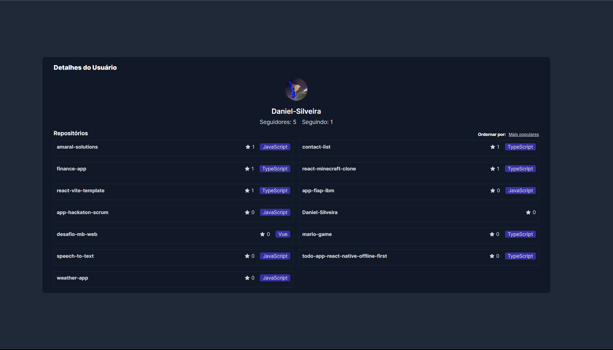

# GitHub User Search

Esta aplicação foi desenvolvida usando Next.js para buscar usuários do GitHub, exibir seus detalhes e listar seus repositórios.

## Tecnologias Utilizadas

- React / Next
- Tailwind CSS

## Passo a passo para rodar o projeto

1. Clone este repositório:

```bash
git clone https://github.com/Daniel-Silveira/github-user-search.git
```

2. Acesse o diretório do projeto:

```bash
 cd github-user-search
```

3. Instale as dependências:

```bash
npm install
# or
yarn
```

4. Como rodar:

```bash
npm run dev
# or
yarn dev
```

### Acesse http://localhost:3000 no seu navegador.


